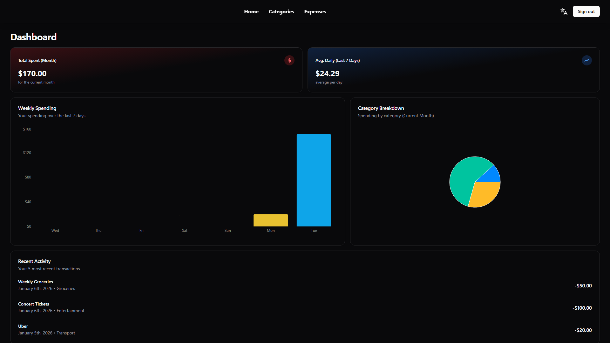
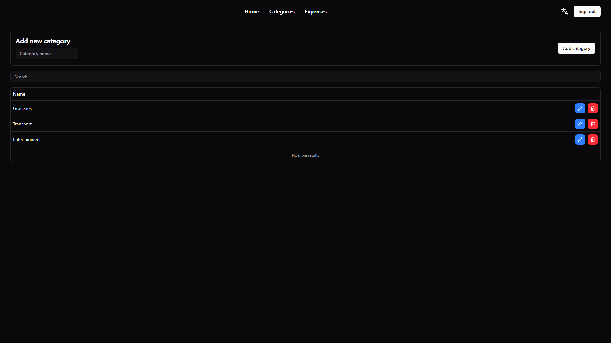
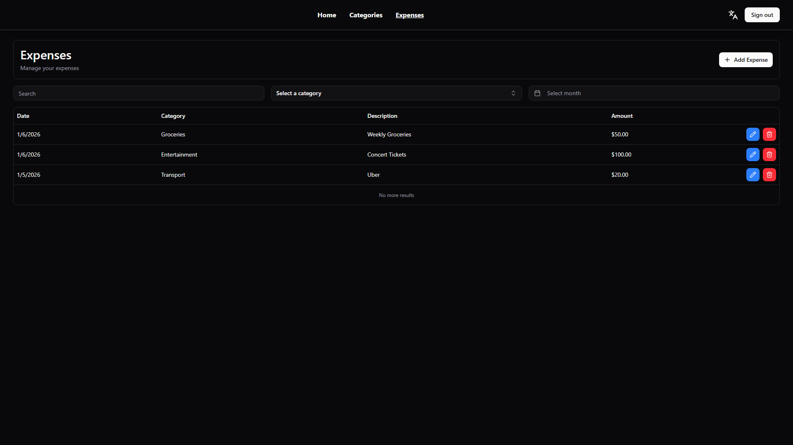

# Expense Management

Expense management application designed to help you take control of your finances. With a sleek user interface and powerful features, tracking your spending has never been easier.

## Features

- **Dashboard Overview**: Get a quick glance at your financial health with monthly spending totals, category breakdowns, and recent activity.
- **Expense Tracking**: Easily add and manage daily expenses with descriptions and dates.
- **Category Management**: Organize your spending into custom categories. Deleting a category smartly cleans up associated expenses.
- **Responsive Design**: Works perfectly on desktop and mobile devices.
- **Secure Authentication**: Built-in authentication to keep your data private.
- **Multi-language Support**: Available in English and Portuguese.

## Getting Started

To run this application locally:

1.  Create a `.env.local` file based on the example:

    ```bash
    cp .env.example .env.local
    ```

    (Or manually copy the file and fill in the required values)

2.  Install dependencies and run:

    ```bash
    # Run the backend
    pnpm dlx convex dev

    # Run the frontend (in a separate terminal)
    pnpm install
    pnpm dev
    ```

## Technologies

- **Frontend**: Tanstack Start, Tailwind CSS
- **Backend**: Convex (Realtime Database & Functions)
- **Authentication**: Better Auth
- **Internationalization**: Paraglide

## Screenshots






